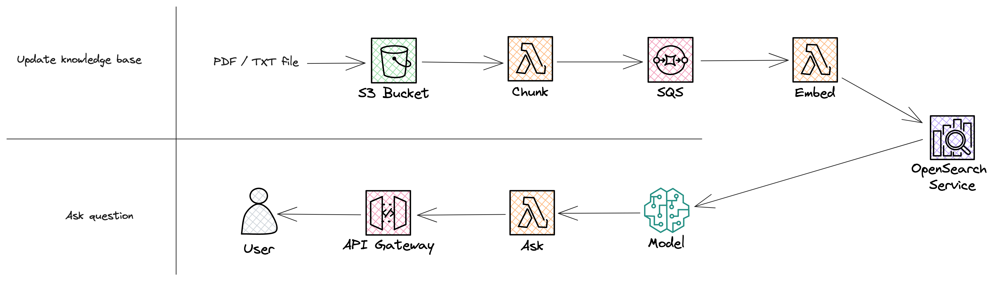

# RAG document chat with Amazon Bedrock using Typescript on Lambda

This repository represents a basic, more-or-less functional prototype-grade implementation of [retrieval augmented generation (RAG)](https://research.ibm.com/blog/retrieval-augmented-generation-RAG) on [Amazon Bedrock](https://aws.amazon.com/bedrock/).

The project uses TypeScript and, I hope, a clear structure to understand the steps, undiluted without [LangChain](https://www.langchain.com) or other magics (other than a [small text-splitting library](https://github.com/golbin/llm-chunk)!).

When making this, unfortunately it was harder than expected to get clear, first-principles examples and guidance, especially if you are not primarily interested in Python as the language. Thanks mainly to [Janakiram MSV's videos on RAG](https://www.youtube.com/watch?v=BXgaK8PPZAE) and a set of examples shared by [David Boyne](https://www.boyney.io) on LinkedIn (unable to find the link, though...) I've been able to get something working that should demonstrate how to think of constructing these capabilities.

I hope this repo will make this technique easier to understand and implement for you, even in you might use a different tech stack.

## Solution



## Prerequisites

- Recent [Node.js](https://nodejs.org/en/) (ideally 20+) installed.
- Amazon Web Services (AWS) account with sufficient permissions so that you can deploy infrastructure. A naive but simple policy would be full rights for CloudWatch, Lambda, API Gateway, and S3.
- Ideally some experience with [Serverless Framework](https://www.serverless.com) as that's what we will use to deploy the service and infrastructure.

## Configuration and setup

In the AWS console:

- Go to the Bedrock page and enable any models you want to use. We will use Jurassic-2 Ultra and Amazon Titan Text Embeddings.
- Create an SQS queue named `document-chat-demo-embeddings` with standard settings.
- Create an OpenSearch Serverless collection using the "Vector search" and "Easy create" options. This will take a few minutes to start up.
- Under `Collections`, select your collection, go into the `Indexes` tab and create a vector index.
  - Select the "JSON" option and paste the contents from `opensearch-index.json` into the text field.
  - Give the index the name `documents`.
  - In the `Collections` view, make note of the OpenSearch URL; you will update the infrastructure configuration in the next step.

In `serverless.yml`:

- Update the values at `custom.awsAccountNumber`, `custom.documentsBucketName` (your choice of random name), and `custom.openSearchUrl` to your values

In your IDE/CLI:

- Deploy the stack with `npm run deploy`

In the AWS console:

- In the console for OpenSearch, under `Serverless > Security > Data access policies`, open the pre-baked policy and add the Lambda functions' roles (`Ask` and `GenerateEmbeddings`) to the selected principals

_There is also a file `src/config/config.ts` that you may wish to modify, if you want a different region or similar._

## Installation

Clone, fork, or download the repo as you normally would. Run `npm install`.

## Commands

- `npm start`: Run application locally
- `npm run build`: Package application with Serverless Framework
- `npm run deploy`: Deploy application to AWS with Serverless Framework
- `npm run teardown`: Remove stack from AWS

## Running

You will need documents for this to use your "own data".

### Adding documents

In the current implementation, the infrastructure allows for S3 events to be emitted for either PDF and TXT files being added to a `documents` folder in your bucket (create this if you haven't already).

However, **the actual chunking function will only currently do anything with `TXT` files**. Feel free to extend this with PDF parsing and whatever you might need. It's not too complicated, and this repo is about showing the principles in a working minimal way, so I've not felt any need to over-invest here and now.

To start the process of embedding vectors on document data, simply upload one of the provided documents (or any other such document) to your buckets `documents` folder. There is a TXT and a PDF file, with essentially the same content, located in the `data` directory.

### Asking questions

The endpoint takes a GET request with a URL-encoded string. If you don't know how to do this by heart, then there are [simple online tools that can help you](https://www.urlencoder.org).

For the question "What does Mikael say about dumb, predictable code?", the call would be:

```bash
curl https://RANDOM_ID.execute-api.REGION.amazonaws.com/\?ask\=What%20does%20Mikael%20say%20about%20dumb%2C%20predictable%20code%3F
```

This will respond back with the LLM's answer in a few seconds.

## Models

### Amazon

- Titan Text Large: `amazon.titan-tg1-large`
- Titan Text Embeddings: `amazon.titan-e1t-medium`
- Titan Text Embeddings v2: `amazon.titan-embed-g1-text-02`
- Titan Text G1 - Express: `amazon.titan-text-express-v1`
- Titan Embeddings G1 - Text: `amazon.titan-embed-text-v1`

### Stability AI

- Stable Diffusion XL: `stability.stable-diffusion-xl`
- Stable Diffusion XL: `stability.stable-diffusion-xl-v0`

### AI21 Labs

- J2 Grande Instruct: `ai21.j2-grande-instruct`
- J2 Jumbo Instruct: `ai21.j2-jumbo-instruct`
- Jurassic-2 Mid: `ai21.j2-mid`
- Jurassic-2 Mid: `ai21.j2-mid-1`
- Jurassic-2 Ultra: `ai21.j2-ultra`
- Jurassic-2 Ultra: `ai21.j2-ultra-v1`

### Anthropic

- Claude Instant: `anthropic.claude-instant-v1`
- Claude: `anthropic.claude-v1`
- Claude: `anthropic.claude-v2`

### Cohere

- Cohere Command: `cohere.command-text-v14`

## Other notes

- Don't forget to add the Lambda IAM profile to OpenSearch's allowed users for the data access policy.
- Don't use the name `vector` for fields in OpenSearch - it won't work :)
- Check in the AWS web console/GUI, on the Bedrock Providers tab, for API request examples.

## References

- [AWS: Supported OpenSearch API operations and permissions](https://docs.aws.amazon.com/opensearch-service/latest/developerguide/serverless-genref.html#serverless-operations)
- [AWS: Identity and Access Management for Amazon OpenSearch Serverless](https://docs.aws.amazon.com/opensearch-service/latest/developerguide/security-iam-serverless.html#security_iam_id-based-policy-examples-data-plane.html)
- [AWS: Ingesting data into Amazon OpenSearch Serverless collections](https://docs.aws.amazon.com/opensearch-service/latest/developerguide/serverless-clients.html#serverless-javascript)
- [OpenSearch: JavaScript client](https://opensearch.org/docs/latest/clients/javascript/index/)
- [OpenSearch: k-NN index](https://opensearch.org/docs/latest/search-plugins/knn/knn-index/)
- [OpenSearch: Approximate k-NN search](https://opensearch.org/docs/latest/search-plugins/knn/approximate-knn/)
- [OpenSearch: Semantic search](https://opensearch.org/docs/latest/ml-commons-plugin/semantic-search/)
- [Janakiram MSV: Implementing RAG with Amazon Bedrock and Amazon Titan - Part 2](https://www.youtube.com/watch?v=BXgaK8PPZAE)
  - [Repo for the above project](https://github.com/janakiramm/rag-bedrock-titan)
